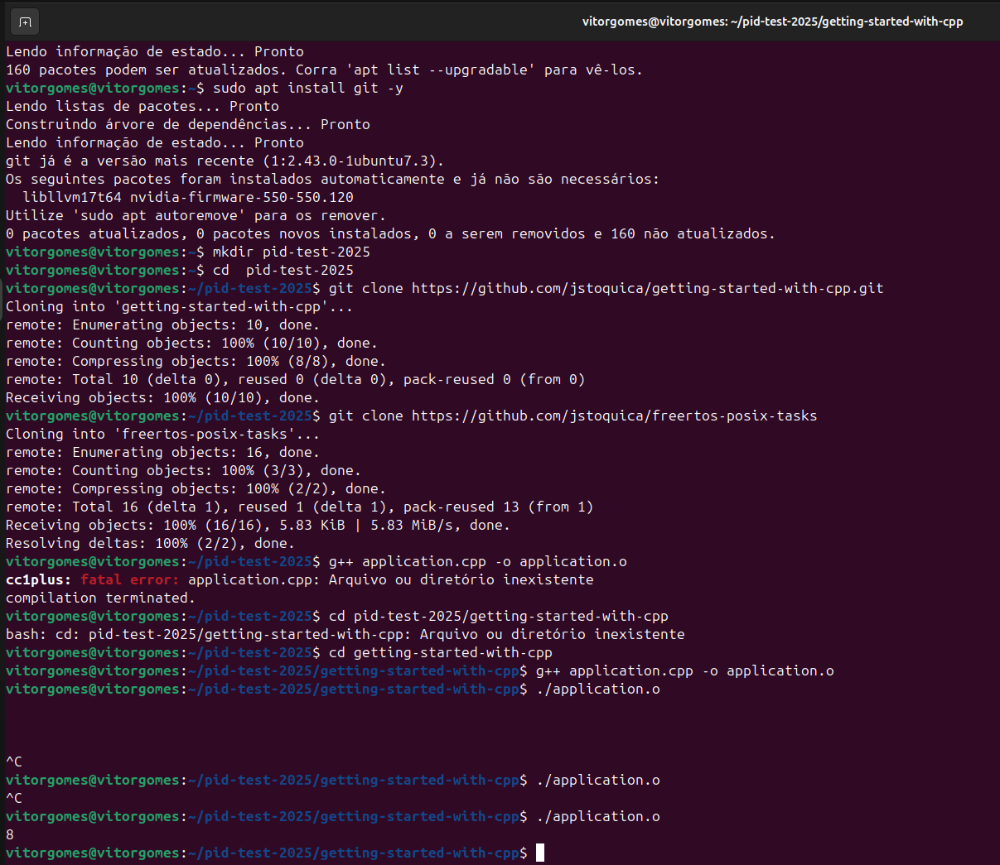
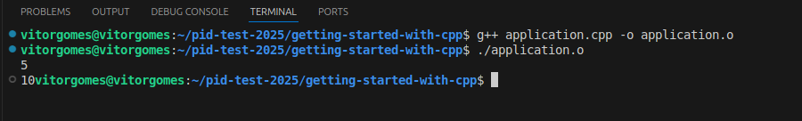

# Getting started with C++

This repository was created for students interested in learning and working with C++. Below are the steps to execute the C++ program:

## 1. Clone the repository
````
  $ git clone https://github.com/jstoquica/getting-started-with-cpp.git
````
## 2. Compile the *.cpp file
````
  $ g++ application.cpp -o application.o
````
## 3. Execute the output file (*.o)
````
  $ ./application.o
````
## 4. The result of the program is the sum of two or more integers, defined in the *.h file as "myfunc()".

It is worth mentioning that the procedures described are based on the G++ compiler for Linux, version 11.4.0. It is also possible to use online C++ compilers, such as https://www.onlinegdb.com/online_c++_compiler.

## Good coding!

## Resultados Obtidos ao executar o arquivo application.o

Ao executar o arquivo, e fornecer a entrada do valor **8** no terminal do LinuX, se obteve a saída: **16**

---

Ao executar o arquivo, e fornecer a entrada do valor **5** no terminal do VSCode, se obteve a saída: **10**




 

---

**Nome:** Vitor Manuel Gomes Vasconcelos

**Matrícula:** 539786
